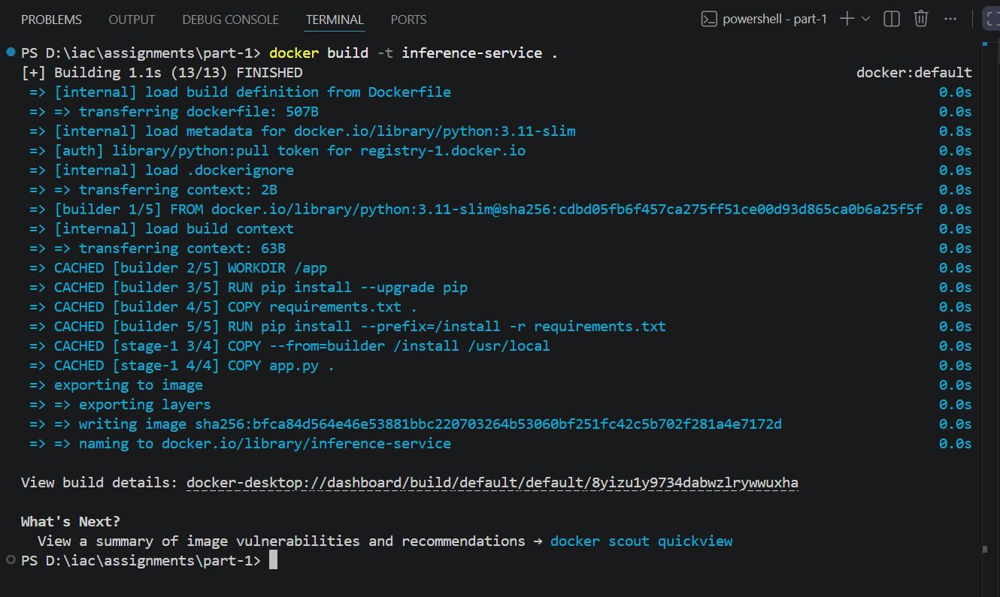
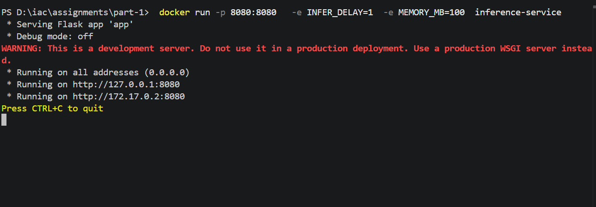
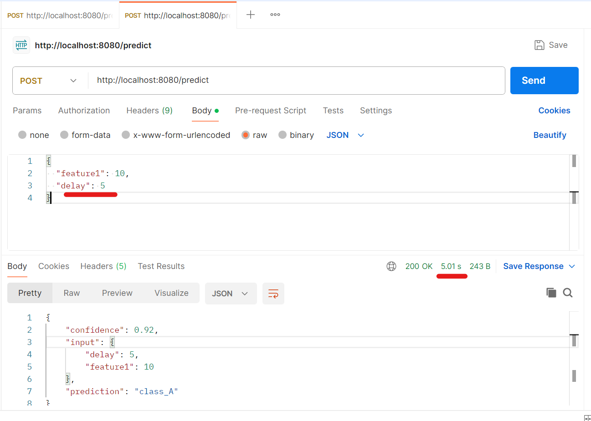
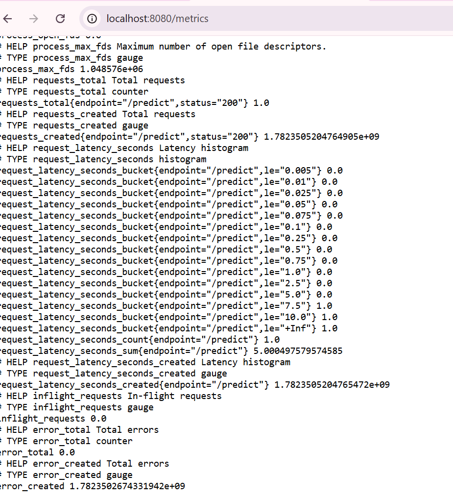

# Flask Inference Service

A Python-based Flask application with multiple endpoints, simulating ML inference workloads with Prometheus metrics and health probes.
---

## Endpoints

- `/predict` → Simulated ML inference endpoint
- `/healthz` → Liveness probe
- `/readyz` → Readiness probe
- `/metrics` → Prometheus metrics endpoint
- Docker multi-stage build

---

## ⚙️ Environment Variables

| Variable | Description | Required |
|----------|-------------|----------|
| INFER_DELAY | Simulated inference delay (seconds) | Yes |
| MEMORY_MB | Memory to allocate at startup (MB) | Yes |

### Build the application:

Build the Docker image using:

```
cd part-1
docker build -t inference-service .
```




### Run the application:
This command runs the Docker container, maps port 8080, and sets environment variables for inference delay and memory usage.

```
 docker run -p 8080:8080   -e INFER_DELAY=1  -e MEMORY_MB=100  inference-service
```



##### healthz endpoint:


##### readyz endpoint:


##### predict endpoint:

Accepts a JSON request with input features and optional `delay`, simulates ML inference by sleeping for the given time, and returns a response with hardcoded prediction (`class_A`) and confidence (`0.92`). It also records Prometheus metrics for request count, latency, errors, and in-flight requests.




###### Metrics endpoint:

