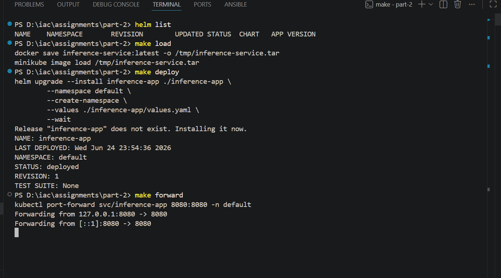
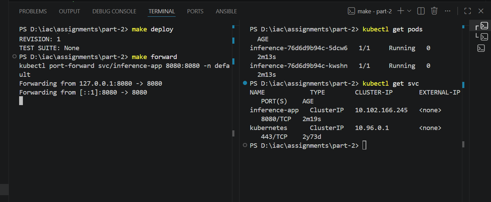

# inference-service

A Helm-based deployment of `inference-service` on a local Minikube cluster, built with production reliability practices.

---

## Why Helm

Helm was chosen over raw YAML or Kustomize for three reasons:

- **Parameterisation** — environment-specific values (replicas, resource sizes, delays) live in `values.yaml` and can be overridden per environment without duplicating manifests.
- **Release management** — `helm upgrade --install` is idempotent, and `helm rollback` gives instant one-command recovery if a release goes bad.
- **Packaging** — the chart is self-contained and portable; anyone can run `make deploy` and get an identical stack.

### Quick Start

```bash
make all        # load image into minikube + deploy helm chart
make forward    # port-forward → http://localhost:8080
make clean      # uninstall helm release
```

 Run all commands from the project root, not inside `inference-app/`


## Image Loading

The image is built locally and loaded into Minikube via tar:

```bash
docker save inference-service:latest -o /tmp/inference-service.tar
minikube image load /tmp/inference-service.tar
```

This is handled automatically by `make all`. If you rebuild the image, re-run `make all` to reload it.

### Horizontal Pod Autoscaler

```yaml
minReplicas: 2
maxReplicas: 5
targetCPUUtilizationPercentage: 60
```

Scaling at 60% leaves 40% headroom so new pods are ready before existing ones saturate. `minReplicas: 2` ensures a single pod failure never causes a full outage.





The below image shows, port-forwarding of svc and the k8s resources likes pods and svc are running with help of helm chart.

