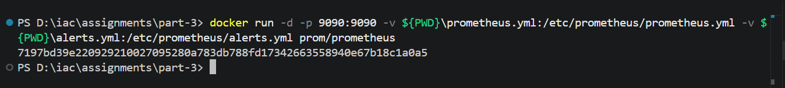
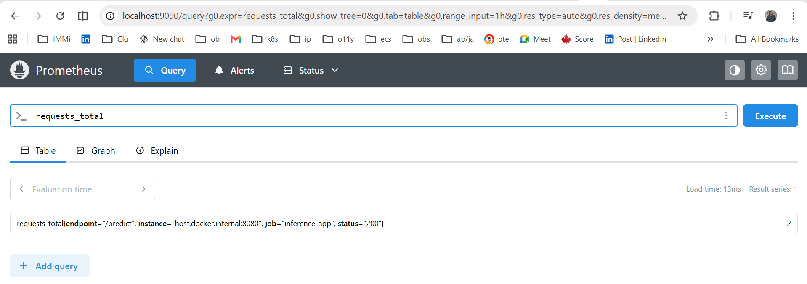
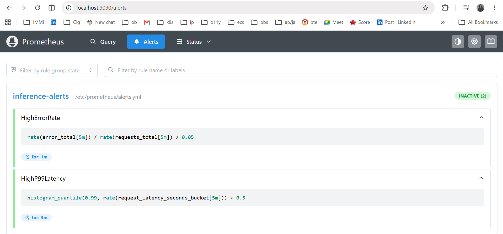
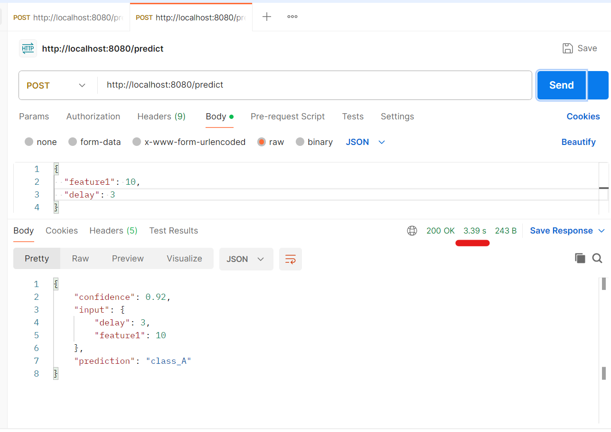
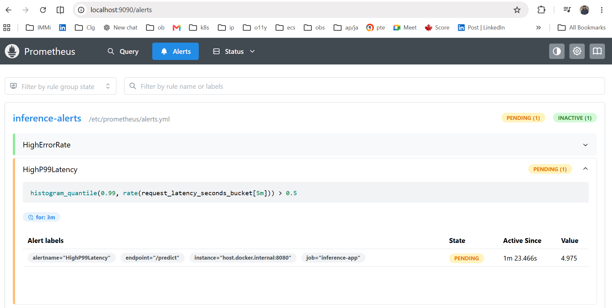

### Breaking the app

1. **Failure 1 — OOMKill (Memory)** :  app allocates MEMORY_MB × 1MB at startup. Set MEMORY_MB higher than resources.limits.memory in values.yaml:

```
helm upgrade --install inference-app ./inference-app --set env.MEMORY_MB=300 --set resources.limits.memory=256Mi --wait
```
##### Installing image:


Describing pod to get events of the pod


2. **Failure 2 — Probe Failure + Pod Restart**

I added a FORCE_FAIL environment variable to simulate runtime failures without changing the app or rebuilding the image. It defaults to false, so the app stays healthy. When set to true, /healthz returns 503, simulating a broken-but-running state for liveness probe testing. 

```
helm upgrade --install inference-app ./inference-app --set env.FORCE_FAIL=true
```


**Describing the pod to view events:**


a.  Kubernetes doesn’t expose metrics by default; you need Metrics Server for kubectl top and HPA.
I’d first use kubectl get pods, kubectl describe pod, and kubectl logs to check state and app errors.
Then I’d correlate logs with metrics (CPU/memory, restarts, probe failures) to identify whether it’s app, resource, or cluster issue.

b.
#### How to Distinguish Failure Types

- **OOMKill** — `kubectl describe pod` shows `Exit Code: 137` and `Reason: OOMKilled` under Last State
- **Probe failure restart** — `kubectl describe pod` shows `Liveness probe failed` in Events and `Exit Code: 1`
- **Node pressure eviction** — `kubectl get events` shows `Reason: Evicted` and `kubectl describe node` shows `MemoryPressure` or `DiskPressure` condition as `True`


3. **Metrics Alert**
## Monitoring

The application exposes Prometheus metrics through the `/metrics` endpoint, including:

* Request count
* Request latency
* Error count

Prometheus is run as a Docker container with `prometheus.yml` and `alerts.yml` mounted as volumes.

* **`prometheus.yml`** configures the scrape target (`/metrics`) from which Prometheus collects metrics.
* **`alerts.yml`** defines alerting rules.

The following alerts are configured:

* **HighErrorRate** – Triggers when more than **5% of requests fail** over a **5-minute** window and the condition persists for **1 minute**.
* **HighP99Latency** – Triggers when the **99th percentile request latency exceeds 500 ms** over a **5-minute** window and the condition persists for **3 minutes**.

 Docker command to run prometheus container

```
ocker run -d -p 9090:9090 -v ${PWD}\prometheus.yml:/etc/prometheus/prometheus.yml -v ${PWD}\alerts.yml:/etc/prometheus/alerts.yml prom/prometheus
```



###### Prometheus dashboard with a request count


###### Alerts Setup


Sending request and increasing resonse latency to trigger alerts.


Alert Triggered



In a cloud setup, alerts can be sent to Slack by configuring an Alertmanager with a Slack webhook receiver.