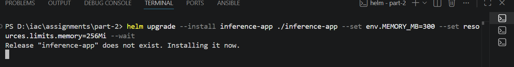
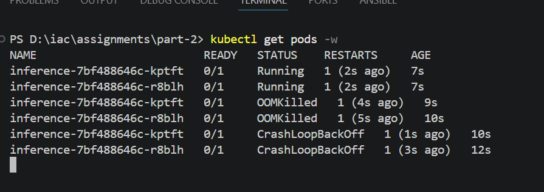
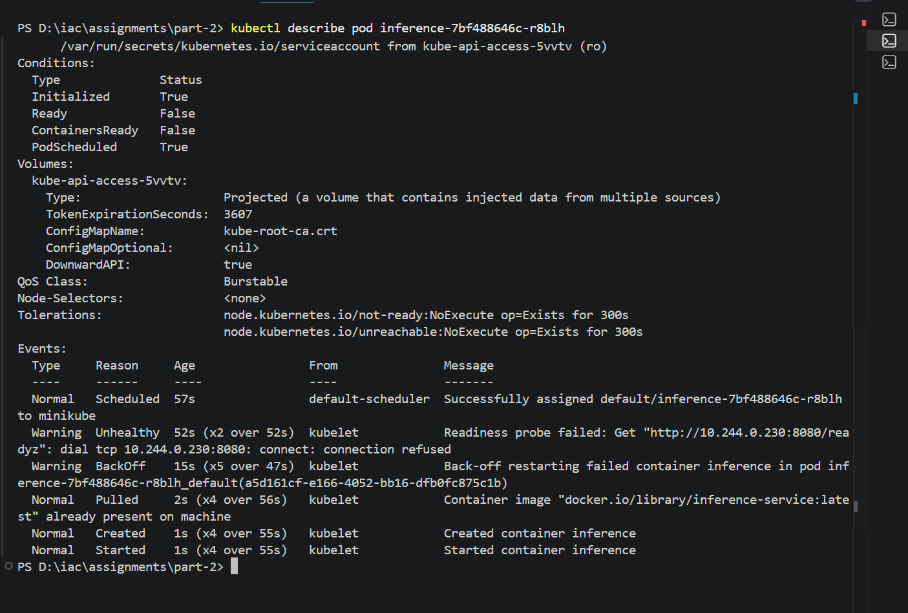
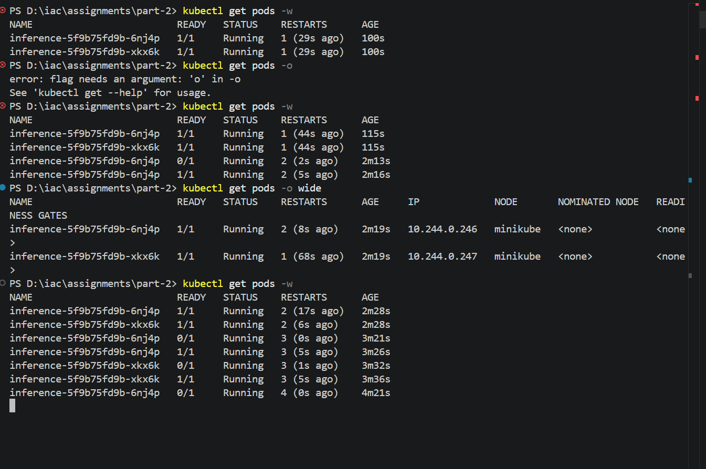
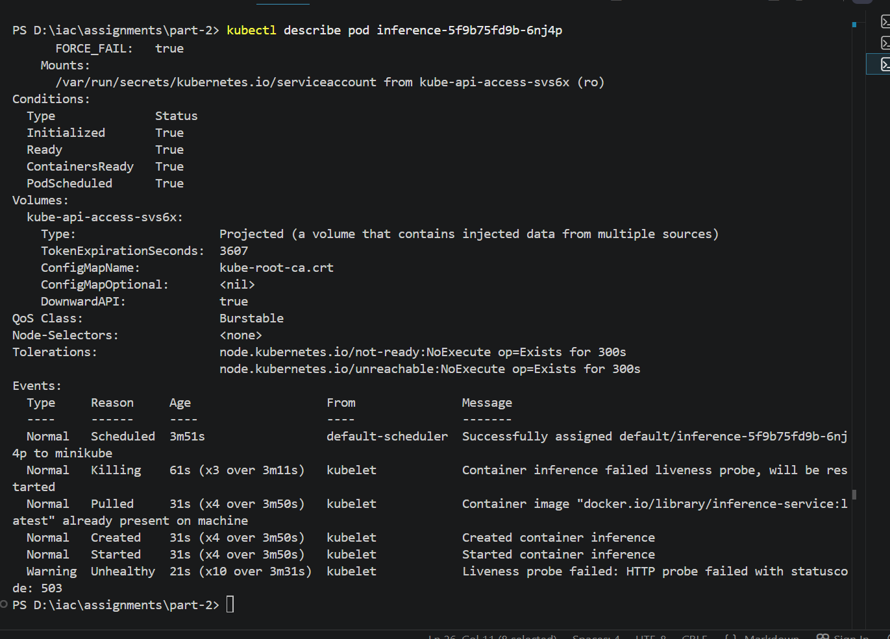

### Breaking the app

1. **Failure 1 — OOMKill (Memory)** :  app allocates MEMORY_MB × 1MB at startup. Set MEMORY_MB higher than resources.limits.memory in values.yaml:

```
helm upgrade --install inference-app ./inference-app --set env.MEMORY_MB=300 --set resources.limits.memory=256Mi --wait
```
##### Installing image:





Describing pod to get events of the pod



2. **Failure 2 — Probe Failure + Pod Restart**

I added a FORCE_FAIL environment variable to simulate runtime failures without changing the app or rebuilding the image. It defaults to false, so the app stays healthy. When set to true, /healthz returns 503, simulating a broken-but-running state for liveness probe testing. 

```
helm upgrade --install inference-app ./inference-app --set env.FORCE_FAIL=true
```




**Describing the pod to view events:**

